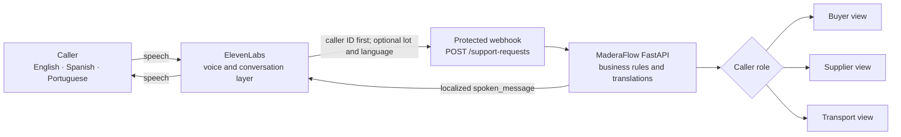
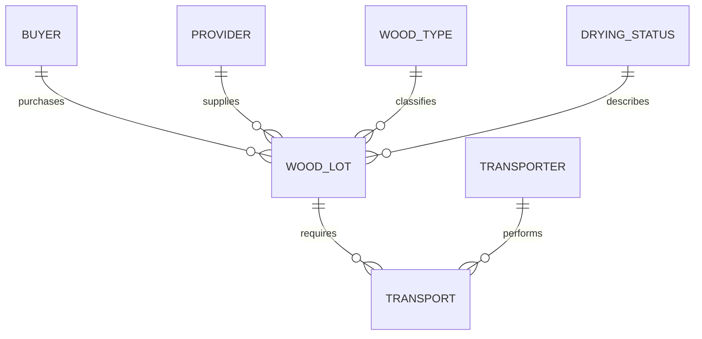

# MaderaFlow Voice Support API

[](https://github.com/molinakpaula/maderaflow-voice-support/actions/workflows/tests.yml)
[](https://maderaflow-voice-support.onrender.com/health)
[](https://www.python.org/)

A contextual multilingual voice-agent demonstration for wood drying and
cross-border logistics support in English, Spanish, and Portuguese.

> **Data boundary:** The MaderaFlow caller, lot, measurement, and transport
> records are sample data. The new Maderera Las Garzas order-intake workflow is
> based on a real business process, but this repository contains no customer
> records, personal WhatsApp number, tax number, transcript, or API secret.

**[Try the voice agent](https://elevenlabs.io/app/talk-to?agent_id=agent_2401kzxk9b7mf3jr3hw5dgcgsjtr&branch_id=agtbrch_3301kzxk9d3jf708fct42bcd8sfx)** ·
**[Explore the live API](https://maderaflow-voice-support.onrender.com/docs)** ·
**[Read the architecture](docs/architecture.md)** ·
**[Open the reviewer checklist](docs/reviewer-demo-checklist.md)** ·
**[Record the demo](docs/demo-video-script.md)**

## New milestone: after-hours order intake

The repository now contains the first backend milestone for a separate
**Maderera Las Garzas** order-intake voice agent. It is intended to receive
after-hours enquiries from Peru and Germany, work in Spanish, German, or
English, collect quotation context, confirm it verbally, and create a pending
request for human review.

This is deliberately separate from the MaderaFlow lot-status agent:

| Workflow | Purpose | Endpoint |
| --- | --- | --- |
| MaderaFlow support demo | Retrieve role-scoped sample lot information | `POST /support-requests` |
| Maderera Las Garzas order intake | Validate and save a new quotation or callback request | `POST /order-requests` |

The order workflow currently provides:

- country and opening-language inference from `+51` and `+49` phone context;
- Spanish, German, and English questions kept in Python;
- a no-transcript callback path when the caller declines retention;
- conditional questions for Peruvian domestic logistics and German exports;
- human-review triggers for unusual species, moisture, deadlines, volume,
  complaints, payments, reservations, and complex export questions;
- idempotent `MLG-PE-...` and `MLG-DE-...` request numbers; and
- local SQLite storage ignored by Git.

The API does **not** yet send WhatsApp messages or ingest ElevenLabs post-call
transcripts. It returns a visible pending notification state and never claims
delivery. Production order intake is disabled by default on Render until
durable storage, retention controls, WhatsApp delivery, and privacy review are
configured. See the [new ElevenLabs configuration](docs/elevenlabs-agent-configuration.md).

MaderaFlow represents a demonstration company headquartered in Puerto Maldonado,
Peru. It coordinates wood drying and cross-border logistics for suppliers,
manufacturers, buyers, and transport partners across Peru, Brazil, and the
United States.

## What this prototype demonstrates

| Capability | Current behavior |
| --- | --- |
| Multilingual voice | One ElevenLabs agent supports English, Spanish, and Portuguese. |
| Contextual answers | Buyer, supplier, and transport-partner responses expose different information. |
| Grounded operations | FastAPI returns fixed sample lot facts and voice-ready messages. |
| Caller-first lookup | The caller provides one ID; the backend identifies the role and assigned lots. |
| Relational context | Wood lots reference buyers, providers, wood types, and drying statuses; transport movements are separate. |
| Speech-friendly IDs | Approved natural aliases are normalized to stable internal identifiers. |
| Guardrails | The agent avoids live-data claims, guarantees, legal advice, liability, and role-inappropriate information. |
| Safe follow-up | Unresolved requests recommend a human during working hours or a ticket after hours; no transfer or ticket is falsely claimed. |

## Architecture



ElevenLabs handles listening, language switching, conversation flow, and
speech. FastAPI remains the source of truth for sample operational facts,
role filtering, escalation signals, and translated support messages.

## Relationship model

The wood lot is the central business record. A buyer or provider can be linked
to many lots, while every lot points to one wood type and one drying status.



Transport is a separate entity rather than a `transporter_id` directly on the
lot. This supports multiple movements for the same lot—for example, provider to
drying facility and later drying facility to buyer. `MF-204` demonstrates this
with an inbound and an outbound transport record.

## Caller-ID-first flow

The voice agent asks for the caller ID first. The API then identifies the
caller's role and assigned lots. If several lots are assigned, it returns only
their IDs and asks the caller to choose a three-digit number. After selection,
the API verifies the relationship and infers the correct intent from the role.

This means the caller does not need to say “I am a buyer” or choose an internal
intent. A caller ID can identify several lots, but it cannot identify one exact
lot in a 1:N relationship; that is why one short lot-selection question remains
necessary.

## Architecture decisions and trade-offs

The [architecture guide](docs/architecture.md) explains component boundaries
and request flow. The [data-model guide](docs/data-model.md) explains the
relationships. Short [Architecture Decision Records](docs/decisions/README.md)
capture why the current choices were made and when they should change.

| Decision | Current benefit | Current limitation | Future direction |
| --- | --- | --- | --- |
| Validated JSON instead of PostgreSQL | Simple, deterministic, and easy to review | No writes, transactions, concurrency, or history | PostgreSQL with migrations and audit records |
| FastAPI owns role filtering | Privacy rules are deterministic and tested | Business-rule changes require deployment | Keep the boundary while moving records to repositories/database |
| Caller-ID-first lookup | Natural voice flow; backend infers role and intent | Multiple lots require one selection question | Authenticated caller identity and remembered context |
| Separate transport entity | Supports inbound and outbound movements | Needs an explicit current-movement rule | Scheduling and movement-event history |
| Shared bearer token | Protects the ElevenLabs webhook simply | Authenticates the integration, not the caller | Signed requests plus caller authentication |
| Python translations | Predictable wording in three tested languages | Copy changes require code deployment | Translation catalogs or reviewed content tooling |

## One-minute voice demo

Start a new conversation for each example so language state does not carry
between tests:

- English buyer: “I am buyer one. What is the status of lot two hundred four?”
- Spanish supplier: “Soy proveedor Perú uno. Quiero revisar la documentación
  del lote trescientos diecisiete.”
- Portuguese transport partner: “Sou logística Brasil um. O transporte do lote
  quatrocentos e vinte e dois pode ser agendado?”

The complete expected results and safety tests are in the
[reviewer demo checklist](docs/reviewer-demo-checklist.md).

## Why caller context matters

The same lot should not produce one generic answer for everyone. The API uses a
demonstration caller profile to select the caller's language and reveal only the
information relevant to that role:

- A **buyer** hears drying progress, the latest recorded moisture value, the
  target moisture, the estimated completion date, and shipment readiness.
- A **supplier** hears whether the lot was received, its documentation status,
  and whether supplier action is required.
- A **transport partner** hears collection readiness, the destination, and
  whether transport can be scheduled. Buyer-specific and pricing information is
  not returned.

This context filtering makes the backend useful for a specialized support agent
instead of a generic voice assistant.

## Supported languages

The protected voice endpoint accepts the active conversation language and
returns `spoken_message` in that language. If the voice layer omits it, the
caller profile's preferred language is used as the default:

| Code | Language |
| --- | --- |
| `en` | English |
| `es` | Spanish |
| `pt` | Portuguese |

## Demonstration caller profiles

| Caller ID | Role | Location | Language | Priority |
| --- | --- | --- | --- | --- |
| `US-BUYER-001` | Buyer | Houston, United States | English | High |
| `PE-SUPPLIER-001` | Supplier | Puerto Maldonado, Peru | Spanish | Normal |
| `BR-LOGISTICS-001` | Transport partner | Rio Branco, Brazil | Portuguese | Normal |

Caller and lot IDs are case-insensitive, so `mf-204` and `MF-204` refer to the
same demonstration lot. The voice endpoint also accepts carefully limited spoken
aliases because speech recognition often removes hyphens or writes letters as
words. It returns the canonical ID in every successful response.

Examples include:

| Spoken or typed value | Canonical ID |
| --- | --- |
| `buyer one` | `US-BUYER-001` |
| `proveedor Perú uno` | `PE-SUPPLIER-001` |
| `logística Brasil um` | `BR-LOGISTICS-001` |
| `lot two zero four` or `lote dos cero cuatro` | `MF-204` |
| `lote tres uno siete` | `MF-317` |
| `lote quatro dois dois` | `MF-422` |

Numeric caller shortcuts such as `US buyer 1`, `proveedor Perú 1`, and
`logística Brasil 1` are also accepted. This avoids failures when speech
recognition converts “one” or “um” to the digit `1`.

Only documented aliases are accepted. A different caller number or lot number
still returns `404 Not Found`; the API does not guess identifiers.

## API endpoints

An API endpoint is an address where another program asks the backend for
information. A `GET` request retrieves information without changing it.

- `GET /health` confirms that the backend can respond.
- `GET /organization` returns the demonstration organization and languages.
- `GET /voice-agent-config` returns a public, non-sensitive contract for a
  voice layer.
- `GET /callers/{caller_id}` returns one demonstration caller profile.
- `GET /callers/{caller_id}/lots` returns the lot IDs assigned to that caller.
- `GET /lots/{lot_id}?caller_id={caller_id}&language={language}` returns a
  role-specific response in an optional supported language.
- `POST /support-requests` requires only `caller_id`. It finds assigned lots and
  infers the role-specific intent; `lot_id`, `intent`, and `language` are optional.
- `GET /docs` opens FastAPI's interactive API documentation.

Unknown caller and lot IDs return `404 Not Found`, meaning the requested
demonstration record does not exist.

## Example requests

After starting the server, these examples ask about the same lot from three
different perspectives.

English buyer response:

```text
http://127.0.0.1:8000/lots/MF-204?caller_id=US-BUYER-001
```

Spanish supplier response:

```text
http://127.0.0.1:8000/lots/MF-204?caller_id=PE-SUPPLIER-001
```

Portuguese transport-partner response:

```text
http://127.0.0.1:8000/lots/MF-204?caller_id=BR-LOGISTICS-001
```

The structured fields and `spoken_message` change because each caller has a
different role and preferred language.

## Voice-ready support requests

The first tool request can contain only the caller ID and active language:

```json
{
  "caller_id": "US-BUYER-001",
  "language": "en"
}
```

Because this buyer has three assigned lots, the API returns `available_lots`
and `next_action: ask_for_lot`. After the caller chooses one, the second request
can remain minimal:

```json
{
  "caller_id": "US-BUYER-001",
  "lot_id": "MF-204",
  "language": "en"
}
```

Only `caller_id` is required. Configure `lot_id`, `intent`, and `language` as
optional ElevenLabs body properties. The backend infers `check_lot_status`,
`check_documentation`, or `check_transport_readiness` from the assigned caller
role when `intent` is omitted.

Canonical IDs and internal English role codes are for software integration, not
for routine speech. The voice agent should confirm them with natural localized
phrases such as "perfil de proveedor" in Spanish or "parceiro de transporte"
in Portuguese. Its language-detection system tool should run before the first
reply whenever the caller begins in another supported language.

The optional `language` field separates spoken language from caller role. For
example, `US-BUYER-001` can receive its buyer-specific lot-status answer in
Spanish by sending `"language": "es"`; omitting the field keeps English as that
profile's default.

The inferred intents are:

- `check_lot_status` for a buyer;
- `check_documentation` for a supplier; and
- `check_transport_readiness` for a transport partner.

The role restriction is intentional. A transport partner cannot use this
endpoint to request buyer-only status details. Spoken messages translate
internal operational codes into natural English, Spanish, or Portuguese, while
structured fields retain stable codes for software integrations.

## Human support and after-hours routing

Demonstration support hours are Monday through Friday, 08:00–18:00 in the
`America/Lima` timezone. Holidays are not modeled yet. These hours are editable
in `config/maderaflow.json`.

If an intent is unsupported or inappropriate for the caller's role:

- during working hours, the response recommends a human handoff;
- after working hours, the response recommends opening a support ticket.

`ticket_created` remains `false`. This milestone recommends the next action but
does not create a real ticket or connect to an external ticketing system.

## Safety boundaries

The API uses fixed demonstration records. It does not:

- invent or claim to retrieve live moisture measurements;
- guarantee an estimated completion date;
- provide legal or customs advice;
- admit liability; or
- expose information unrelated to the caller's role.

For a high-priority buyer, `escalation_recommended` becomes `true` when a lot is
delayed, is not transport-ready near its required date, or has a recorded
quality problem. This is a support-routing signal, not an admission of liability.

## Project files

- `main.py` is the stable four-line Uvicorn and Render entry point.
- `maderaflow/api.py` defines FastAPI middleware, authentication dependencies,
  public contracts, and HTTP routes.
- `maderaflow/config.py` loads environment settings and validates all configured
  relationships at startup without importing FastAPI.
- `maderaflow/models.py` defines the typed webhook request and language codes.
- `maderaflow/errors.py` defines domain errors without depending on FastAPI;
  the API boundary translates them into HTTP responses.
- `maderaflow/repositories.py` normalizes speech-friendly IDs and resolves
  caller, lot, and transport assignments.
- `maderaflow/support.py` owns role disclosure, intent inference, escalation,
  translations, and voice-ready messages.
- `maderaflow/order_intake.py` owns Spanish/German/English order questions,
  conditional requirements, phone-country inference, escalation, and human
  notification formatting.
- `maderaflow/order_storage.py` creates idempotent request IDs and stores local
  development records in SQLite without adding another Python dependency.
- `config/maderaflow.json` contains editable demonstration organization, caller,
  wood-type, drying-status, lot, transport, escalation, and support-hours data.
  Keeping these facts outside Python makes the context configurable without
  changing application logic.
- `config/order_intake.json` contains public business capabilities, working
  hours, capacities, and order-review rules. Personal contacts and secrets are
  intentionally excluded.
- `docs/elevenlabs-integration-contract.md` documents the voice webhook tool,
  conversation flow, safety rules, and multilingual examples for reviewers.
- `docs/reviewer-demo-checklist.md` provides repeatable end-to-end voice,
  privacy, safety, and handoff checks for demonstrations and reviews.
- `docs/demo-video-script.md` gives a scene-by-scene script for recording a
  short reviewer-facing product demonstration without exposing secrets.
- `docs/elevenlabs-agent-configuration.md` contains the reviewed system prompt,
  multilingual greetings, voice settings, and conversation tests.
- `docs/architecture.md`, `docs/data-model.md`, and `docs/decisions/` explain
  system boundaries, relationships, alternatives, and consequences.
- `tests/test_main.py` sends automated requests through the application and
  checks successful responses, errors, language selection, role-specific
  content, escalation, and confidentiality boundaries.
- `tests/test_architecture.py` protects the thin entry point, expected module
  structure, framework-independent configuration, and decision records.
- `tests/test_order_intake.py` covers Peru/Germany routing, three order
  languages, consent refusal, callback-only storage, German and Spanish order
  creation, idempotency, conditional questions, and escalation rules.
- `.github/workflows/tests.yml` repeats the full suite on Python 3.11, 3.12,
  and 3.13 for every push to `main` and every pull request.
- `requirements.txt` pins FastAPI, Uvicorn, and timezone data needed to reproduce
  Lima working-hours checks consistently across platforms.
- `.gitignore` prevents virtual environments, environment secrets, editor
  settings, and generated Python cache files from being committed.
- `render.yaml` describes a reproducible Render web service and uses `/health`
  to decide whether a deployment is ready.
- `LICENSE` grants use, modification, and distribution under the MIT License
  while retaining the copyright notice and warranty disclaimer.

## Set up on Windows

Open PowerShell in the project directory and activate the existing virtual
environment:

```powershell
.\.venv\Scripts\Activate.ps1
```

Install the pinned requirements if needed:

```powershell
python -m pip install -r requirements.txt
```

No database or external account is required for the public read-only endpoints.
The protected support endpoint needs a local `MADERAFLOW_TOOL_TOKEN` when tested
outside ElevenLabs.

## Change demonstration business data

Edit `config/maderaflow.json` to change demonstration caller profiles, lot facts,
enabled escalation triggers, or support hours. Restart the development server
after saving the file. On startup, `maderaflow/config.py` checks that required
sections exist, IDs match their configuration keys, and all caller, lot, wood,
status, and transport references are valid.

Translations remain in `maderaflow/support.py`. This keeps operational wording
and role-based privacy behavior covered by automated tests. Do not put secrets
or real customer, shipment, employee, or sensor data in the configuration file.

## Start and try the backend

Start the development server:

```powershell
python -m uvicorn main:app --reload
```

In `main:app`, `main` means `main.py`, and `app` is the FastAPI application
inside that file. Visit <http://127.0.0.1:8000/docs> to try each endpoint in a
browser.

## Deploy on Render

Render is the recommended host for the first public demonstration because it can
deploy FastAPI directly from GitHub, provide an HTTPS address, and check
`/health` before treating a deployment as healthy. The repository's
`render.yaml` contains the build command, production start command, environment
name, log level, and health-check path.

To deploy:

1. Create or sign in to a Render account.
2. Connect the GitHub repository.
3. Create a new Blueprint and select this repository.
4. Review the proposed `maderaflow-voice-support` web service.
5. Deploy it, then test `/health`, `/voice-agent-config`, and `/docs` at the
   assigned HTTPS address.

The Blueprint selects Render's free plan for a demonstration. Free services can
sleep while idle, causing a slow first response. Use an always-on paid service
before a scheduled voice-agent review where latency matters.

Application logs contain only the HTTP method, route template, response status,
duration, and environment. They intentionally omit request bodies, query
strings, caller IDs, and lot IDs.

## Protect the support tool

`POST /support-requests` requires an `Authorization: Bearer ...` header. Public
information endpoints remain open. The secret itself must never be committed.

Generate a 256-bit token in PowerShell:

```powershell
[Convert]::ToBase64String(
  [Security.Cryptography.RandomNumberGenerator]::GetBytes(32)
)
```

Copy the result directly into these two private settings:

1. In Render, open the service's **Environment** page and add
   `MADERAFLOW_TOOL_TOKEN` with the generated token as its value.
2. In the ElevenLabs webhook tool, add an `Authorization` header, choose the
   secret-value option, and store `Bearer ` followed by the same token.

Do not paste the token into chat, source code, documentation, or GitHub. A
missing server secret returns `503`; a missing or incorrect request token
returns `401`.

## Run the automated tests

```powershell
python -m unittest discover -s tests -v
```

The tests use Python's built-in testing tools, so no extra test package is
required.

## ElevenLabs integration

The demonstration ElevenLabs agent follows this flow:

```text
Caller speech
    -> ElevenLabs voice layer
    -> protected webhook supplies caller ID and active language to FastAPI
    -> FastAPI identifies the role and assigned lots
    -> caller selects a lot only when several are assigned
    -> FastAPI verifies the assignment and infers the intent
    -> context-aware spoken_message
    -> ElevenLabs speech response
```

The API returns a `spoken_message` in the caller's preferred language,
and ElevenLabs speaks that message. Business rules, role filtering, and
demonstration lot context stay inside the backend. Twilio, Supabase, caller
authentication, real ticket creation, and real customer data remain outside
this milestone.

See `docs/elevenlabs-integration-contract.md` for the reviewer-facing tool
schema, intent mapping, handoff behavior, and English, Spanish, and Portuguese
conversation examples.

## License

This project is available under the [MIT License](LICENSE). It permits use,
copying, modification, distribution, and commercial use as long as the
copyright and license notice remain included. The software is provided without
a warranty.
