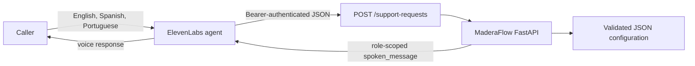
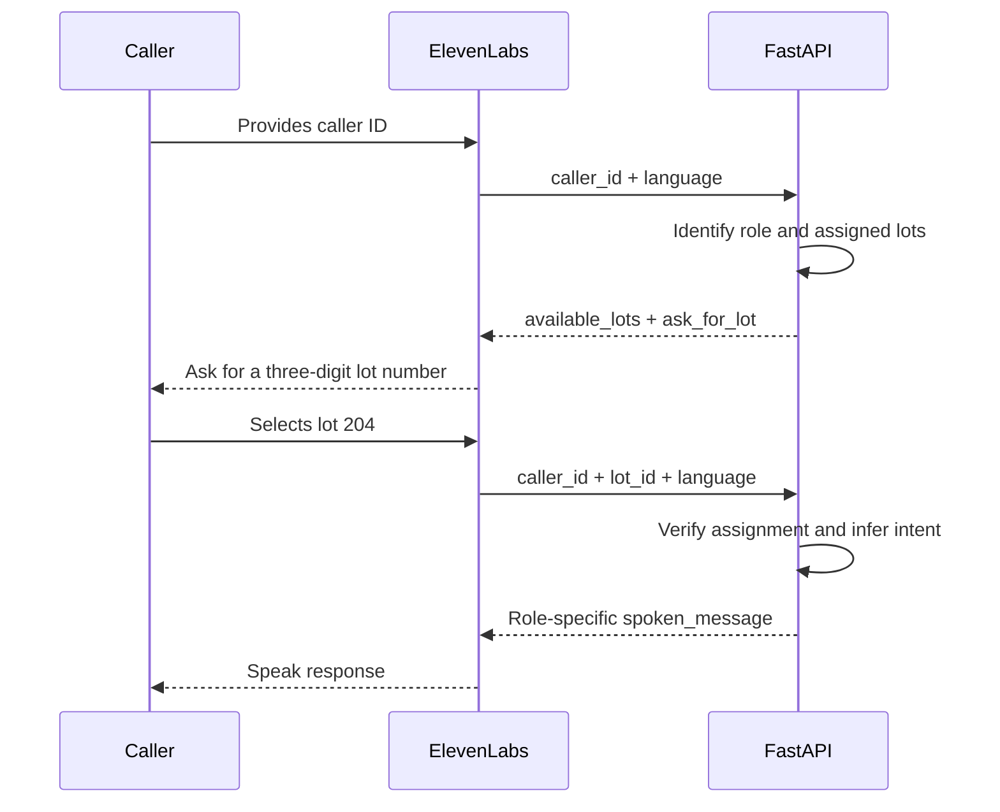

# MaderaFlow Architecture

## Purpose

MaderaFlow demonstrates a multilingual voice-support workflow for wood drying
and cross-border logistics coordination. ElevenLabs provides speech and
conversation orchestration. FastAPI remains the authoritative boundary for
caller assignments, operational records, role-specific disclosure, language
selection, and escalation decisions.

All records in this repository are sample data. The system is not connected to
live customers, measurements, ticketing, telephony, or logistics systems.

## System context



## Request sequence



If exactly one lot is assigned, FastAPI can skip the selection question. With
several assigned lots, choosing a lot is unavoidable because a 1:N relationship
does not identify one unique record.

## Component responsibilities

| Component | Responsibility | Must not do |
| --- | --- | --- |
| ElevenLabs | Speech recognition, language switching, conversational turns, tool calls | Invent operational facts or decide authorization |
| FastAPI routes | HTTP validation, authentication dependency, safe request logging | Contain business-specific response wording |
| Repository layer | Normalize approved aliases and resolve caller/lot/transport relationships | Decide what a role may hear |
| Support service | Infer intent, apply role disclosure, translate responses, calculate escalation | Access external services |
| Configuration layer | Load and validate sample records and foreign-key-style references | Store secrets or real customer data |

## Code structure

```text
main.py                         Stable Uvicorn/Render entry point
maderaflow/
    api.py                      FastAPI app, middleware, dependencies, routes
    config.py                   Environment and validated configuration
    models.py                   API request models and shared types
    errors.py                   Framework-independent domain errors
    repositories.py             Identifier and assignment lookup
    support.py                  Business rules and multilingual responses
config/maderaflow.json          Editable sample business records
tests/test_main.py              HTTP and architecture regression tests
```

Dependencies point inward: `api` calls `support` and `repositories`; those
modules use `config` and `models`. The configuration layer does not import the
web framework. This keeps business behavior testable without binding it to an
HTTP route.

## Trust boundaries

The webhook is protected by a bearer token stored independently in Render and
ElevenLabs. The token authenticates the integration, not the human caller.
Caller IDs therefore provide demonstration context, not production identity.

FastAPI verifies that the requested lot is assigned to the recognized caller
before building a response. Transport responses exclude buyer, procurement,
price, moisture, and completion information. Logs contain route templates and
status metadata but omit request bodies, query strings, caller IDs, and lot IDs.

## Current limitations

- JSON provides no transactional writes, concurrent updates, or history.
- Caller IDs are spoken context rather than authenticated identities.
- The shared bearer token protects one integration, not individual callers.
- Ticket creation and human transfer are recommendations only.
- Completion dates and moisture values are fixed recorded samples.
- Translations are maintained in Python and require a deployment to change.

These limitations are intentional for the current milestone and are recorded in
the architecture decisions rather than hidden.
