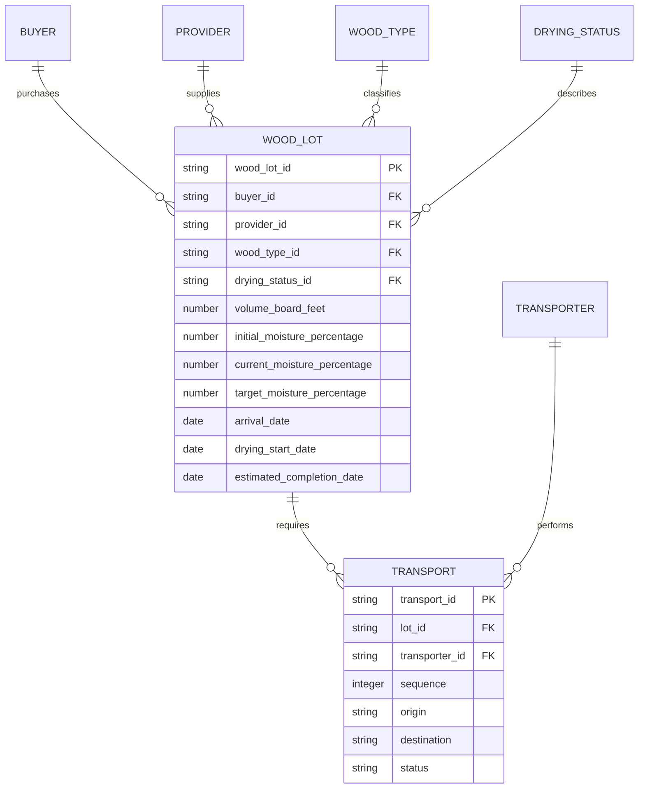

# MaderaFlow Data Model

## Central entity

`WOOD_LOT` is the central operational record. It connects commercial context,
supplier context, drying state, wood classification, and transport movements.

## Why transport is separate

Putting `transporter_id` directly on a wood lot would allow only one transport
relationship. Realistic logistics may require an inbound movement from the
provider to the drying facility and a later outbound movement from the facility
to the buyer. The separate `TRANSPORT` entity represents both movements while
preserving one central lot record.

`MF-204` demonstrates this design with two ordered transport movements.

## Caller-to-lot resolution

| Caller type | Assignment source |
| --- | --- |
| Buyer | `WOOD_LOT.buyer_id` |
| Provider | `WOOD_LOT.provider_id` |
| Transport partner | `TRANSPORT.transporter_id` joined through `TRANSPORT.lot_id` |

The internal caller type remains `supplier` for compatibility with the current
API, while the lot relationship uses the business name `provider_id`.

## Integrity rules

Application startup rejects configuration when:

- a lot references a caller that is not a buyer;
- a lot references a caller that is not a provider;
- a lot references an unknown wood type or drying status;
- a transport references an unknown lot; or
- a transport references a caller that is not a transport partner.

Automated tests also verify that transporter IDs are stored on transport
movements rather than directly on lots.

## Future database mapping

The JSON keys currently behave like primary and foreign keys. A later
PostgreSQL migration can create `callers`, `wood_lots`, `wood_types`,
`drying_statuses`, and `transports` tables without changing the API contract.

Before using live data, the design would also need authenticated caller
identities, audit history, database migrations, tenant boundaries, and rules for
which transport movement is considered current.
